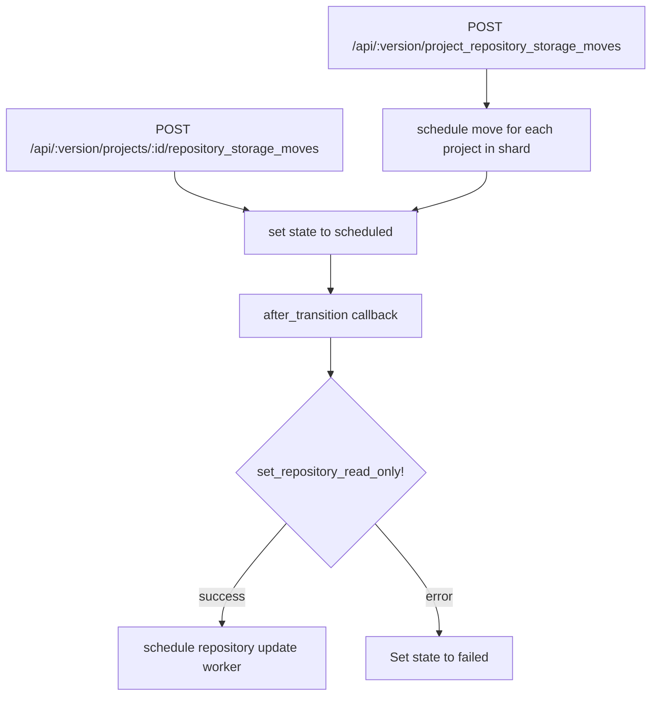
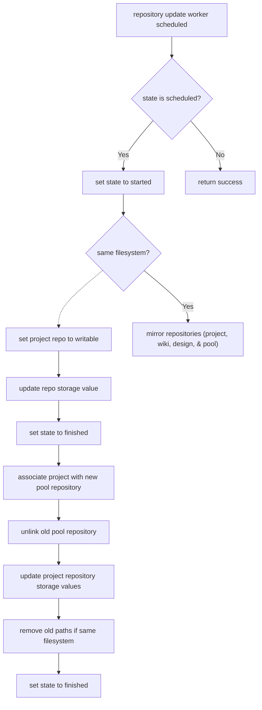

# Project Repository Storage Moves

This document was created to help contributors understand the code design of
[project repository storage moves](../../api/project_repository_storage_moves.md).
You should read this document before making changes to the code for this feature.

This document is intentionally limited to an overview of how the code is
designed, as code can change often. To understand how a specific part of the
feature works, view the code and the specs. The details here explain how the
major components of the Code Owners feature work.

NOTE:
This document should be updated when parts of the codebase referenced in this
document are updated, removed, or new parts are added.

## Business logic

- `Projects::RepositoryStorageMove`: Tracks the move, includes state machine.
  - Defined in `app/models/projects/repository_storage_move.rb`.
- `RepositoryStorageMovable`: contains the state machine logic, validators, and some helper methods.
  - Defined in `app/models/concerns/repository_storage_movable.rb`.
- `Project`: The project model.
  - Defined in `app/models/project.rb`.
- `CanMoveRepositoryStorage`: Contains helper methods that are into `Project`.
  - Defined in `app/models/concerns/can_move_repository_storage.rb`.
- `API::ProjectRepositoryStorageMoves`: API class for project repository storage moves.
  - Defined in `lib/api/project_repository_storage_moves.rb`.
- `Entities::Projects::RepositoryStorageMove`: API entity for serializing the `Projects::RepositoryStorageMove` model.
  - Defined in `lib/api/entities/projects/repository_storage_moves.rb`.
- `Projects::ScheduleBulkRepositoryShardMovesService`: Service to schedule bulk moves.
  - Defined in `app/services/projects/schedule_bulk_repository_shard_moves_service.rb`.
- `ScheduleBulkRepositoryShardMovesMethods`: Generic methods for bulk moves.
  - Defined in `app/services/concerns/schedule_bulk_repository_shard_moves_methods.rb`.
- `Projects::ScheduleBulkRepositoryShardMovesWorker`: Worker to handle bulk moves.
  - Defined in `app/workers/projects/schedule_bulk_repository_shard_moves_worker.rb`.
- `Projects::UpdateRepositoryStorageWorker`: Finds repository storage move and then calls the update storage service.
  - Defined in `app/workers/projects/update_repository_storage_worker.rb`.
- `UpdateRepositoryStorageWorker`: Module containing generic logic for `Projects::UpdateRepositoryStorageWorker`.
  - Defined in `app/workers/concerns/update_repository_storage_worker.rb`.
- `Projects::UpdateRepositoryStorageService`: Performs the move.
  - Defined in `app/services/projects/update_repository_storage_service.rb`.
- `UpdateRepositoryStorageMethods`: Module with generic methods included in `Projects::UpdateRepositoryStorageService`.
  - Defined in `app/services/concerns/update_repository_storage_methods.rb`.
- `Projects::UpdateService`: schedules move if the passed parameters request a move.
  - Defined in `app/services/projects/update_service.rb`.
- `PoolRepository`: Ruby object representing Gitaly `ObjectPool`.
  - Defined in `app/models/pool_repository.rb`.
- `ObjectPool::CreateWorker`: Worker to create an `ObjectPool` via `Gitaly`.
  - Defined in `app/workers/object_pool/create_worker.rb`.
- `ObjectPool::JoinWorker`: Worker to join an `ObjectPool` via `Gitaly`.
  - Defined in `app/workers/object_pool/join_worker.rb`.
- `ObjectPool::ScheduleJoinWorker`: Worker to schedule an `ObjectPool::JoinWorker`.
  - Defined in `app/workers/object_pool/schedule_join_worker.rb`.
- `ObjectPool::DestroyWorker`: Worker to destroy an `ObjectPool` via `Gitaly`.
  - Defined in `app/workers/object_pool/destroy_worker.rb`.
- `ObjectPoolQueue`: module to configure `ObjectPool` workers.
  - Defined in `app/workers/concerns/object_pool_queue.rb`.
- `Repositories::ReplicateService`: Handles replication of data from one repository to another.
  - Defined in `app/services/repositories/replicate_service.rb`.

## Flow

These flowcharts should help explain the flow from the endpoints down to the
models for different features.

### Schedule a repository storage move via the API

### Moving the storage after being scheduled

